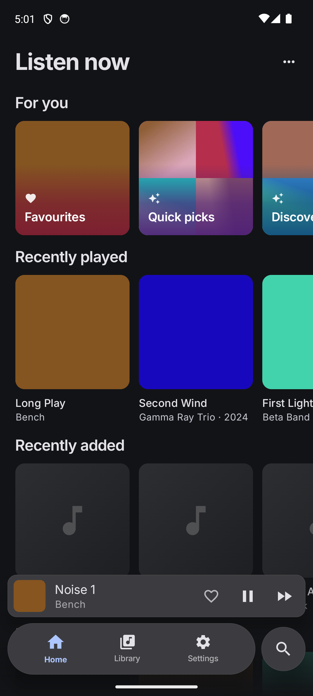
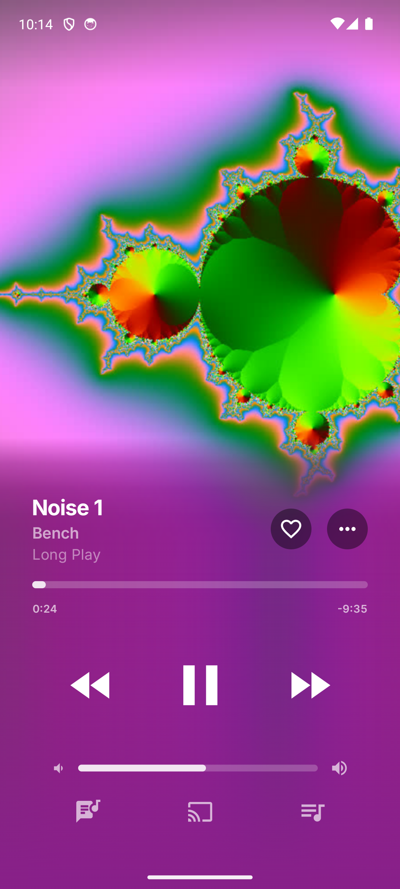
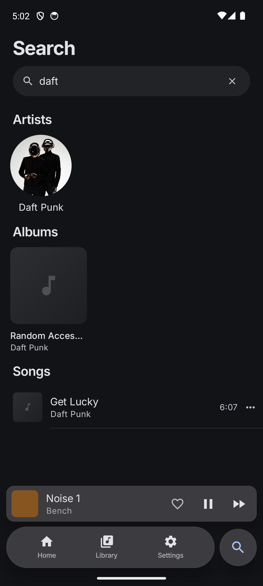
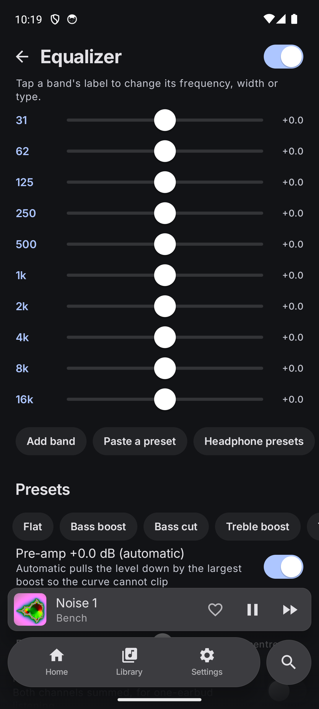
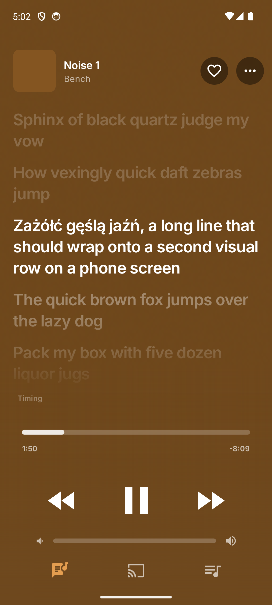

<p align="center">
  
</p>

<h1 align="center">Nori</h1>

<p align="center">
  A native Android client for Navidrome and octo-fiesta.<br>
  Battery first, then features, then looks.
</p>

<p align="center">
  <a href="https://github.com/filipton/Nori/releases/latest"></a>
  
  
  
</p>

<p align="center">
  <a href="#install">Install</a> ·
  <a href="#measured">Measured</a> ·
  <a href="#what-it-does">Features</a> ·
  <a href="BENCHMARKS.md">Benchmarks</a> ·
  <a href="#build">Build</a>
</p>

---

<p align="center">
  
  &nbsp;
  
  &nbsp;
  
</p>
<p align="center">
  <sub>Listen now · Player · Library</sub>
</p>

<p align="center">
  
  &nbsp;
  
  &nbsp;
  
</p>
<p align="center">
  <sub>Search · Equalizer · Lyrics</sub>
</p>

## Measured

Same emulator, same server, same track, screen off — release Nori against
Play builds of the alternatives. Quiet seconds are how often the process
almost never woke: the number that decides overnight battery.

| | **Nori 0.3.1** | Symfonium | musly | Navic |
|---|---|---|---|---|
| CPU while playing (MP3 / FLAC / EQ) | **1.26 / 1.30 / 1.35 %** | 10.7 / 8.74 / 13.4 % | 4.01 / 4.70 / no EQ | 3.10 / 3.72 / 2.92 % |
| Seconds asleep of 90 (MP3 / FLAC / EQ) | **75 / 69 / 73** | 1 / 0 / 1 | 0 / 0 / 0 | 1 / 1 / 1 |
| Cold start | **~590 ms** | ~900 ms | ~1050 ms | ~700 ms |

Nothing polls with the screen off. Audio is decoded into 10 s bursts so the
CPU sleeps most of every playing minute. Full table and method:
[BENCHMARKS.md](BENCHMARKS.md).

## What it does

**Playback** — gapless, hardware offload, burst buffering, ReplayGain,
a queue that survives process death, shuffle / repeat, sleep timer,
internet radio, AutoMix (beat-aware transitions).

**Sound** — parametric EQ in Rust (peaks, shelves, passes, notches,
per-channel bands, Equalizer APO paste-in, AutoEQ headphone curves),
crossfeed, balance, mono, look-ahead limiter, per-output profiles.
Changes apply on the fly with no silence.

**Bit-perfect USB** — Android 14+, the track's own sample rate straight
to the DAC.

**Offline** — downloads, stars, ratings, playlist edits and plays queued
and replayed later; rolling stream cache; offline search; optional bridge
that keeps playing local downloads when the server drops.

**Library** — live FTS search as you type, home shelves, bios, similar
artists, playlists, favourites, ratings, genres, song radio, a queue
shared with your other devices.

**Integration** — home-screen widget, share links, media notification,
headset buttons, Android Auto, scrobbling.

Not there yet: casting, smart playlists, multiple servers, formats the
platform cannot decode (DSD, APE, WavPack), integer 24/32-bit bit-perfect.

## Install

```sh
tools/apk.sh           # release APK for a phone (arm64)
tools/apk.sh x86_64    # for an emulator
tools/apk.sh --install # build and push to whatever is connected
```

Lands in `build/nori-music-<version>-<abi>.apk`. Signed with the Android
debug key — fine on your own devices, not for Play Store.

## Build

```sh
./gradlew :app:assembleDebug -PrustTargets=x86_64   # fast emulator build
./gradlew :app:assembleRelease                      # arm64 + x86_64
cargo test
tools/dev-server.sh                                 # local Navidrome + generated music
```

Needs the Android SDK + NDK, Rust Android targets, and `cargo-ndk`.
`tools/app.sh` drives a debug build over adb; `tools/audio-e2e.sh` and
`tools/feature-e2e.sh` check playback and the rest against a real server.

## How it is put together

| Layer | Role |
|---|---|
| `crates/` | Rust: signing, parsing, SQLite/FTS5, equalizer DSP |
| `core/` | Kotlin: net, library, media3 service, downloads, settings — no UI |
| `app/` | Compose UI + ViewModels only; may be thrown away and rewritten |

`ui/` reads ViewModel state and calls ViewModel functions. It never
touches networking, media3 or the FFI.

## More

- [Battery shootout](BENCHMARKS.md) · raw traces in [`perf-shootout.md`](perf-shootout.md)
- [What's planned](docs/features.md) · [where the work stopped](docs/handoff.md)
- [Working in this repo](AGENTS.md)

Provider items (`ext-…`) show a cloud icon and are never indexed or
auto-queued — streaming one makes the proxy download it first. A search
tap plays that one song only, for the same reason.
